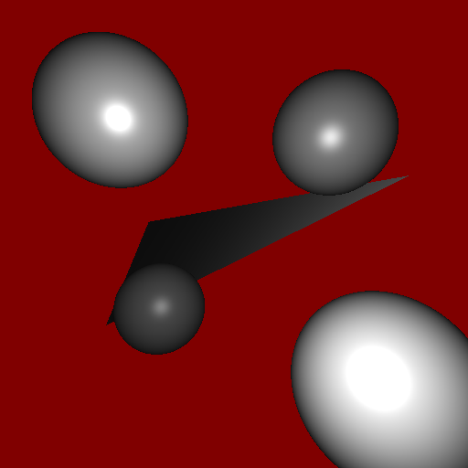
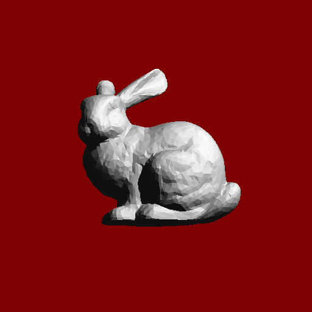
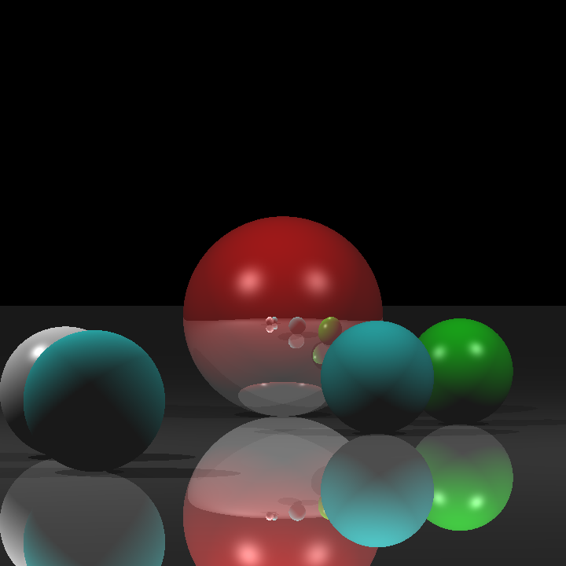
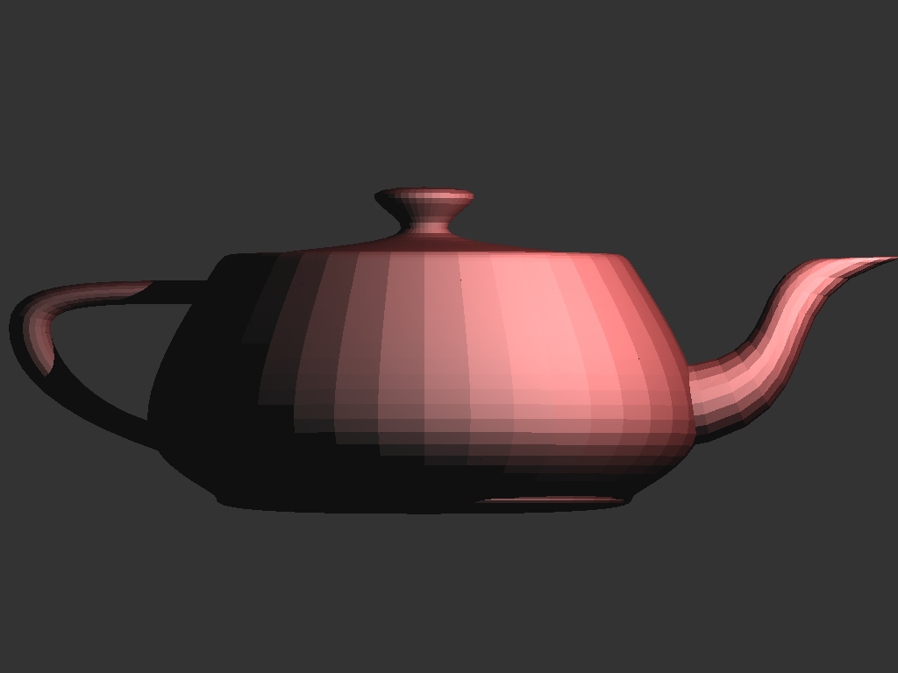
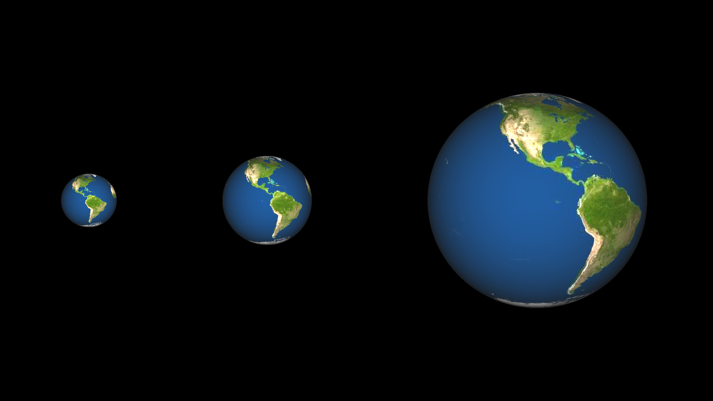
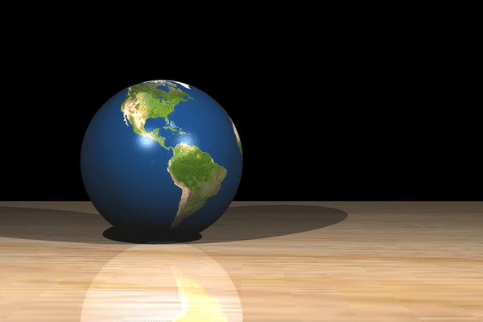
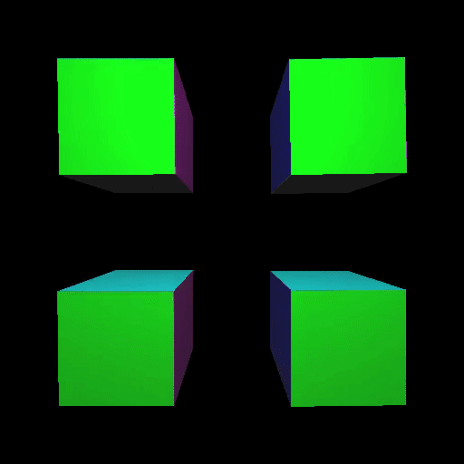

# Raytracer


Full implementation of **raytracer** with forward rendering pipeline, modeling transformations, viewing transformations, triangle rasterization and interpolation, texture mapping. Each folder contains related implementation and output results.


## Raytracer


### Results
<p float="left">
  
   
  
  
</p>

### Run
```
$ make 
$ ./raytracer <input_path_to_scene>  <input_path_to_camera> 
$ ./raytracer ./inputs/scenes/att_test_scene.txt ./inputs/cameras/att_test_camera.txt
$ ./raytracer ./inputs/scenes/bunny_scene.txt ./inputs/cameras/bunny_camera.txt 
$ ./raytracer ./inputs/scenes/spheres_scene.txt ./inputs/cameras/spheres_camera.txt
$ ./raytracer ./inputs/scenes/teapot_scene.txt ./inputs/cameras/teapot_camera.txt 
```


***

## Raytracer With Texture Mapping

Implementation is under **raytracer_with_texture_mapping** folder. 

**Note:** Software generates image of each frame and then creates **.mp4** file. Thus, it may consume large memory and time.

### Results
<p float="left">
  
   
  
</p>


### Run
```
$ make 
$ <path_to_makeVideo.sh> ./raytracer <input_path_to_scene>  <input_path_to_camera> out_put_name
$ ./inputs/scripts/makeVideo.sh ./raytracer ./inputs/scenes/four_cubes ./inputs/cameras/four_cubes four_cubes
$ ./inputs/scripts/makeVideo.sh ./raytracer ./inputs/scenes/rolling_earth ./inputs/cameras/rolling_earth rolling_earth
```


***

## Raytracer with Forward Rendering Pipeline

**raytracer_with_Forward Rendering_Pipeline** folder contains implementation of  **modeling transformation**, **viewing transformation**, and **rasterization** stages of the Forward Rendering Pipeline. Generated results are in **.ppm** format.


### Results
<p float="left">
  
   
  
</p>


### Run

```
$ make 
$ ./rasterizer ./inputs/1_s.txt ./inputs/1_c.txt
$ ./rasterizer ./inputs/2_s.txt ./inputs/2_c.txt
$ ./rasterizer ./inputs/3_s.txt ./inputs/3_c.txt

```


## keywords
- forward rendering pipeline
- modeling transformations 
- viewing transformations 
- line drawing
- triangle rasterization
- interpolation
- depth buffer
- backface culling


